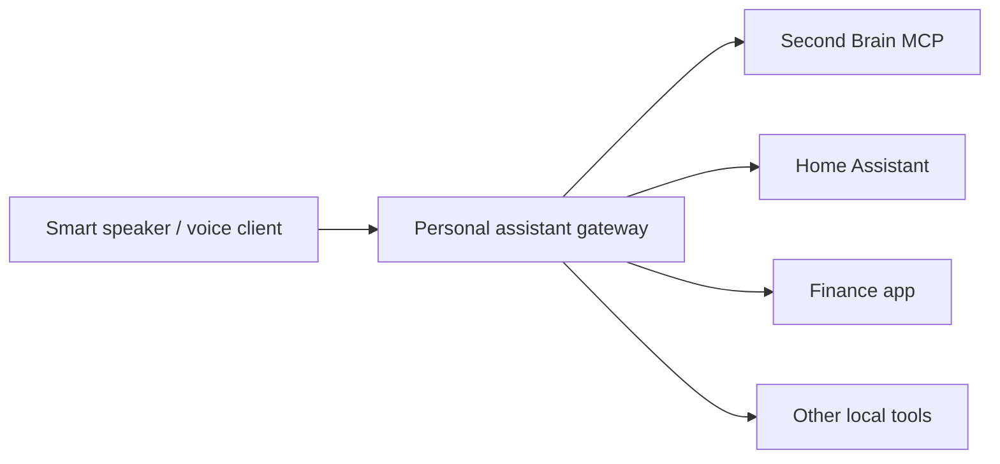

# Future MCP Server Plan

This is a deferred feature plan for exposing the Second Brain app as an MCP server later. It is intentionally not an implementation task yet. The current app should stay focused on capture, tasks, sprint/OKR tracking, OpenCode chat, and Mac mini reliability.

## Why Defer

MCP would be a large capability boundary: it could expose vault reads, vault writes, chat, task actions, and future assistant integrations to other clients. That is useful, but it also increases the security surface. The safer path is to keep the current app stable, document the architecture now, and build MCP only when there is a concrete consumer.

## Future Goal

The long-term idea is a personal assistant hub:

The smart speaker should not talk directly to the vault. It should talk to an authenticated gateway, and that gateway should call narrow, auditable tools exposed by Second Brain, Home Assistant, finance tools, and any future local services.

## Architecture Options

### 1. Local stdio MCP

Best first implementation.

- Runs on the Mac mini beside the webapp.
- Used by local developer tools or local assistant runtimes.
- No network exposure.
- Smaller security surface.
- Good for validating the tool contract before exposing anything remotely.

### 2. Network MCP

Useful later for voice assistants, Home Assistant integrations, or remote clients.

- Runs over authenticated HTTP.
- Should live behind HTTPS.
- Should require explicit auth separate from the public web UI session.
- Should expose only allowlisted tools.
- Should keep write tools narrow and confirmable.

### 3. Assistant Gateway

Not part of the first MCP pass.

- Coordinates multiple tools: Second Brain, Home Assistant, finance app, calendar, and other local services.
- Performs intent routing.
- Applies cross-service safety policies.
- Owns voice-session state and wake-word/client concerns.

## Proposed Implementation Order

1. Write internal service boundaries inside the existing app.
   - Extract reusable operations for capture, tasks, sprint, dashboard, chat action workflows, and vault path safety.
   - Keep HTTP routes as callers of those services.

2. Add local stdio MCP.
   - Tool-only server.
   - No network listener.
   - Read-only tools first.
   - Then narrow write tools that reuse existing Markdown formats.

3. Add audit logging.
   - Log tool name, timestamp, caller identity if available, affected note path, and whether the operation wrote to the vault.
   - Never log secrets or full sensitive note bodies.

4. Add optional network MCP.
   - Require HTTPS and explicit auth.
   - Add rate limits.
   - Add tool allowlists by client.
   - Keep LAN and public-domain auth modes separate, similar to the webapp.

5. Build assistant gateway only when a real voice/smart-speaker client exists.

## Candidate MCP Tools

Read tools:

- `vault.search`
- `vault.read_note`
- `capture.recent`
- `tasks.list`
- `sprint.current`
- `dashboard.summary`
- `deepwork.history`

Write tools:

- `capture.append`
- `tasks.create`
- `tasks.complete`
- `tasks.update_metadata`
- `sprint.update_weekly_checkbox`
- `deepwork.start`
- `deepwork.end`

Chat/workflow tools:

- `chat.start_session`
- `chat.send_message`
- `chat.summarize_session`
- `chat.extract_todos`
- `chat.create_note_draft`

The first version should prefer read tools plus `capture.append` and `tasks.create`. Anything that mutates existing notes should wait until the audit and safety model is proven.

## Security Considerations

- Markdown remains the source of truth.
- SQLite remains an operational index, not an authority for writes.
- Every path must be resolved inside `VAULT_PATH`; reject path traversal.
- Do not expose arbitrary file reads.
- Do not expose arbitrary file writes.
- Do not expose shell execution.
- Do not expose raw OpenCode control unless the caller is trusted.
- Require authentication for all network MCP calls.
- Use a separate MCP token/client credential from GitHub web login.
- Support client-specific allowlists, for example:
  - smart speaker: capture, task creation, dashboard summary
  - desktop assistant: vault search/read, chat session tools
  - automation service: limited sprint/dashboard reads
- Prefer confirmation for destructive or broad changes.
- Add audit logs before enabling write tools.
- Keep secrets out of tool responses.

## Smart Speaker Considerations

The voice assistant should use a small set of natural, safe operations:

- Quick capture.
- Create todo.
- Read today's focus.
- Ask what is due now.
- Start or end Deep Work.
- Summarize active sprint status.
- Ask the Second Brain chat a question with selected context.

The speaker should not directly browse arbitrary vault files by default. It should ask through high-level tools that return concise, spoken-friendly answers.

## Relationship To OpenCode

OpenCode should remain the chat runtime for now. The future MCP server should not replace OpenCode by default.

Possible future modes:

- MCP exposes operational tools; OpenCode remains chat brain.
- OpenCode can call Second Brain MCP tools if configured as a client.
- A future assistant gateway can call both OpenCode and Second Brain MCP.

## Non-Goals For The First MCP Pass

- Docker-first deployment.
- Public internet MCP access.
- Multi-user support.
- Full RAG replacement.
- Arbitrary vault file mutation.
- Voice assistant implementation.
- Home Assistant integration.
- Finance app integration.

## Open Questions

- Which MCP clients will be used first?
- Should network MCP be LAN-only or public-domain accessible?
- Should MCP share the existing `APP_SECRET`, or use a dedicated `MCP_SECRET`?
- Which write tools need confirmation?
- Where should audit logs live: `.data/audit`, a SQLite table, or both?
- Should chat tools use OpenCode sessions directly or the webapp's `/api/chat` wrapper?
