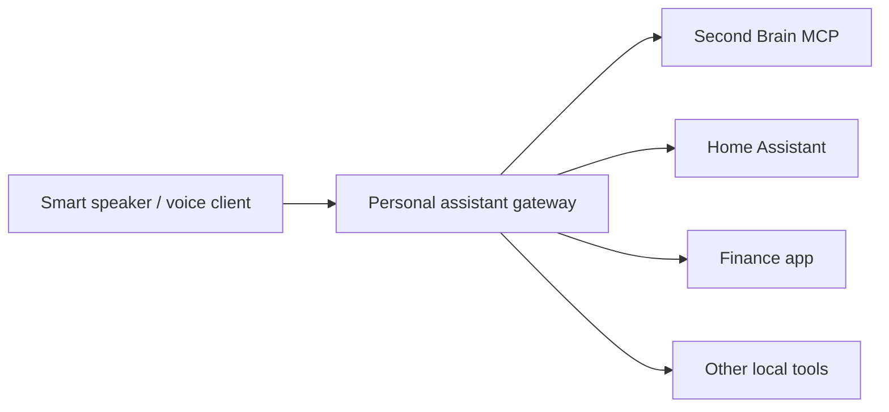

# MCP Server Plan

The app now includes a small MCP-compatible HTTP endpoint for trusted LAN/internal clients. The current implementation is intentionally narrow: it exposes operational tools for capture, tasks, sprint, and dashboard, while keeping broad vault access and chat deferred.

## Current Status

Implemented:

- Streamable-HTTP-style JSON-RPC endpoint at `/mcp`.
- Separate listener controlled by `MCP_ENABLED`, `MCP_HOST`, and `MCP_PORT`.
- Token auth via `Authorization: Bearer <MCP_TOKEN>`.
- Local compatibility with the existing app token when bound to loopback.
- Tool allowlist via `MCP_ALLOWED_TOOLS`.
- CORS origin allowlist via `MCP_ALLOWED_ORIGINS`; browser origins are denied unless explicitly allowed.
- Per-IP/token rate limiting via `MCP_RATE_LIMIT_WINDOW_MS` and `MCP_RATE_LIMIT_MAX`.
- JSONL audit log via `MCP_AUDIT_LOG`.
- MCP client name capture via `X-MCP-Client`, `X-Client-Name`, or `_meta.clientName`.
- Optional client-specific tool scopes via `MCP_CLIENT_TOOL_ALLOWLISTS`.
- MCP audit status in webapp Settings through `/api/mcp/audit`.
- LAN/client setup guide in `docs/mcp-client-setup.md`.
- First-pass tools only by default.

Still deferred:

- Chat tools.
- Arbitrary vault note read/write.
- Public internet access.

## Future Goal

The long-term idea is a personal assistant hub:



The smart speaker should not talk directly to the vault. It should talk to an authenticated gateway, and that gateway should call narrow, auditable tools exposed by Second Brain, Home Assistant, finance tools, and any future local services.

## Architecture Options

### 1. Local stdio MCP

Optional future implementation.

- Runs on the Mac mini beside the webapp.
- Used by local developer tools or local assistant runtimes.
- No network exposure.
- Smaller security surface.
- Good for validating the tool contract before exposing anything remotely.

### 2. Network MCP

Current implementation target for internal LAN clients.

- Runs over authenticated HTTP on `/mcp`.
- Should live behind HTTPS.
- Should require explicit auth separate from the public web UI session.
- Should expose only allowlisted tools.
- Should keep write tools narrow and confirmable.

### 3. Assistant Gateway

Not part of the first MCP pass.

- Coordinates multiple tools: Second Brain, Home Assistant, finance app, calendar, and other local services.
- Performs intent routing.
- Applies cross-service safety policies.
- Owns voice-session state and wake-word/client concerns.

## Implementation Order

Done:

1. Write internal service boundaries inside the existing app.
   - Extract reusable operations for capture, tasks, sprint, dashboard, chat action workflows, and vault path safety.
   - Keep HTTP routes as callers of those services.
   - Current prework lives in `src/capabilities/manifest.js`, which defines the future tool contract without enabling MCP.
   - Current HTTP routes for capture, task listing/completion, sprint, dashboard, vault search, and chat now call an internal `executeCapability(name, input)` boundary after authenticating.

2. Add LAN-capable HTTP MCP.
   - Tool-only server.
   - Separate port.
   - Token auth required for LAN binding.
   - Narrow first-pass write tools that reuse existing Markdown formats.

3. Add audit logging.
   - Log tool name, timestamp, caller identity if available, affected note path, and whether the operation wrote to the vault.
   - Never log secrets or full sensitive note bodies.
   - Audit status is visible in Dashboard settings.

Still left:

4. Harden network MCP.
   - Done for first pass: optional client-specific tool allowlists.
   - Keep LAN and public-domain auth modes separate, similar to the webapp.
   - Keep public internet MCP unsupported unless a reverse proxy/auth layer is deliberately added.

5. Build assistant gateway only when a real voice/smart-speaker client exists.

## Candidate MCP Tools

Default first-pass tools:

- `capture.recent`
- `tasks.list`
- `sprint.current`
- `dashboard.summary`
- `capture.append`
- `tasks.create`
- `sprint.set_daily_focus`

Available in the manifest but intentionally not default-enabled:

- `tasks.complete`
- `tasks.update_metadata`
- `sprint.update_weekly_checkbox`
- `deepwork.start`
- `deepwork.end`
- `deepwork.history`
- `vault.search`
- `vault.read_note`, restricted and audited

Deferred chat/workflow tools:

- `chat.start_session`
- `chat.send_message`
- `chat.summarize_session`
- `chat.extract_todos`
- `chat.create_note_draft`
- monthly/weekly review workflow tools
- about-me/changelog workflow triggers via vault skills

Anything that mutates existing notes beyond daily focus should wait until the audit and safety model is proven.

## Security Considerations

- Markdown remains the source of truth.
- SQLite remains an operational index, not an authority for writes.
- MCP starts disabled in `.env.example`.
- MCP can bind to `0.0.0.0` for LAN use only when `MCP_TOKEN` is set.
- Local MCP can use the existing app-token model.
- If `MCP_TOKEN` is set, use it.
- If `MCP_TOKEN` is not set, local-only development may fall back to `APP_SECRET`.
- If MCP binds to a LAN/public interface, startup fails without explicit `MCP_TOKEN`.
- GitHub OAuth is browser auth only; do not use it as MCP client auth.
- Every path must be resolved inside `VAULT_PATH`; reject path traversal.
- Do not expose arbitrary file reads.
- Do not expose arbitrary file writes.
- Do not expose shell execution.
- Do not expose raw agent control unless the caller is trusted.
- Require authentication for all network MCP calls.
- Prefer `Authorization: Bearer <MCP_TOKEN>` for MCP clients, while allowing the current `X-Second-Brain-Secret` app-token header for local compatibility.
- Support client-specific allowlists, for example:
  - smart speaker: capture, task creation, dashboard summary
  - desktop assistant: vault search/read, chat session tools
  - automation service: limited sprint/dashboard reads
- Prefer confirmation for destructive or broad changes.
- Add audit logs before enabling write tools.
- Keep secrets out of tool responses.
- Add confirmation rules before enabling existing-note edits from network clients.
- Add separate tokens per client before connecting Home Assistant or a voice gateway.

## Smart Speaker Considerations

The voice assistant should use a small set of natural, safe operations:

- Quick capture.
- Create todo.
- Read today's focus.
- Ask what is due now.
- Start or end Deep Work.
- Summarize active sprint status.
- Ask the Second Brain chat a question with selected context.

The speaker should not directly browse arbitrary vault files by default. It should ask through high-level tools that return concise, spoken-friendly answers.

## Relationship To Hermes

Hermes is the chat runtime. The future MCP server should expose narrow Second Brain tools and, where useful, call the webapp's existing chat wrapper instead of exposing Hermes directly.

Possible future modes:

- MCP exposes operational tools; Hermes remains chat brain.
- Hermes or another assistant can call Second Brain MCP tools if configured as a client.
- A future assistant gateway can call Hermes plus Second Brain MCP tools.

## Non-Goals For The First MCP Pass

- Docker-first deployment.
- Public internet MCP access.
- Multi-user support.
- Full RAG replacement.
- Arbitrary vault file mutation.
- Voice assistant implementation.
- Home Assistant integration.
- Finance app integration.

## Future Architecture Refactor

Current code has an MCP transport module at `src/mcp/httpServer.js`, capability metadata in `src/capabilities/manifest.js`, and the trusted execution boundary in `server.js`.

Future cleanup should split the trusted operation implementations into service modules:

- `src/services/captureService.js`
- `src/services/taskService.js`
- `src/services/sprintService.js`
- `src/services/dashboardService.js`
- `src/services/vaultSearchService.js`
- `src/services/chatService.js`
- `src/services/auditService.js`

The target shape remains:

```text
HTTP routes
        \
         executeCapability -> service modules -> vault/sqlite/hermes
        /
MCP tools
```

Keep transport/auth at the edges. Keep service modules trusted and transport-agnostic.

## Open Questions

- Which MCP clients will be used first?
- Should network MCP be LAN-only or public-domain accessible?
- Should the first implementation accept only `Authorization: Bearer <MCP_TOKEN>`, or also accept `X-Second-Brain-Secret` for local compatibility?
- Which write tools need confirmation?
- Where should audit logs live: `.data/audit`, a SQLite table, or both?
- Should chat tools use Hermes directly or the webapp's `/api/chat` wrapper?
